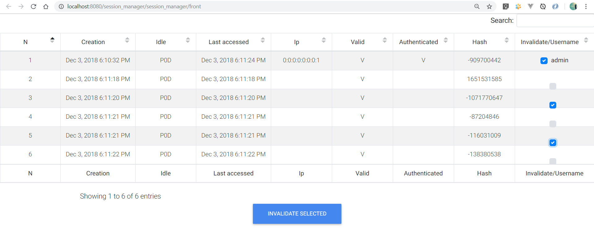
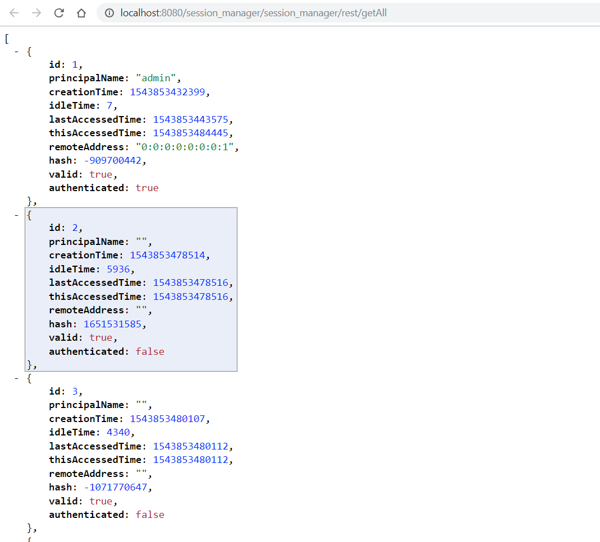

# Tomcat session manager for Spring boot
## Purpose
- Web UI and Rest session managment.
 
 
- List of current sessions . 
- List Authentificated users and client ip. 
- Invalidate selected sessions
## Stack
- Kotlin 
- Spring Boot 
- Tomcat 
- Projectreactor (WebFlux)
- Thymeleaf
- MDBootstrap (Material Design)
## Modules description
- [core](core) - SessionManager and Rest API interface .
- [front](front) - web UI with MDBootstrap and Thymeleaf.
## Config url
Change module url in [application.yml](demo/src/main/resources/application.yml#L55) file , by default is : digital.equinox.session_manager.baseurl: /session_manager
## Mobile client
Currently not exist. If this project will have many stars Mobile client will born :)

# Hope you enjoy this project and will be useful for your projects

Created Aleksandr for study Spring Framework
Contacts : https://xandrwix.wixsite.com/resume